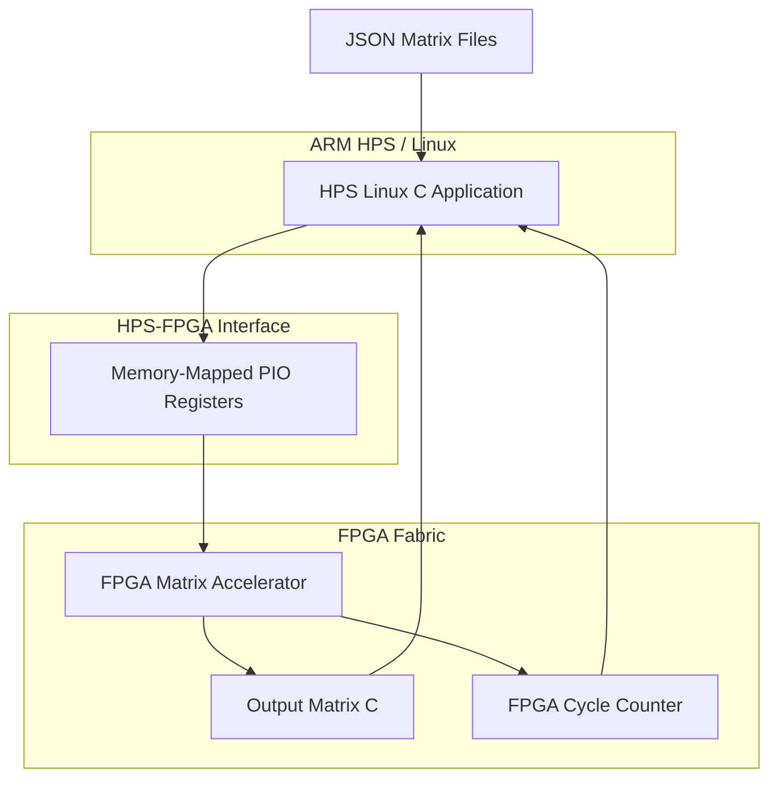
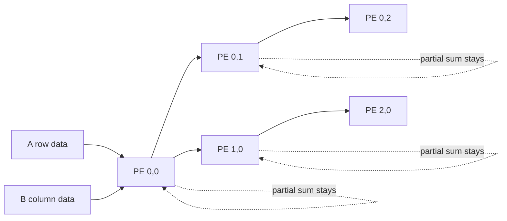
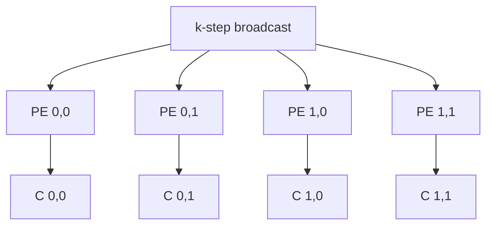
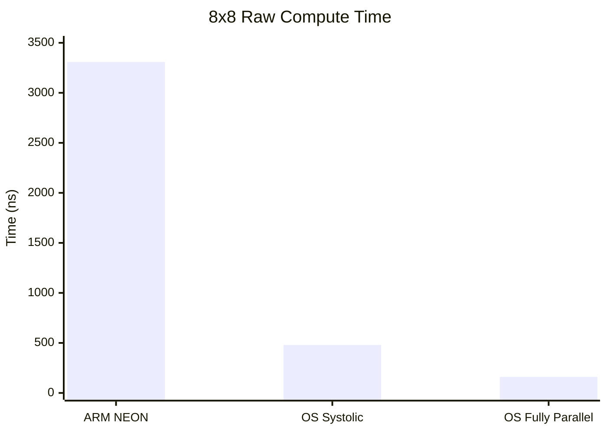
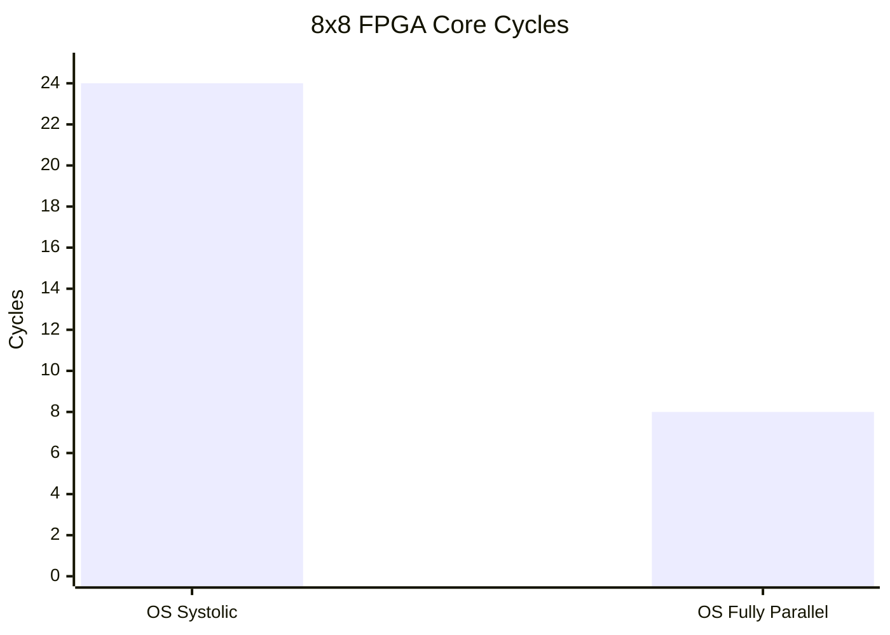

# FPGA Matrix Multiplication Accelerator on Intel Cyclone V SoC

[](#)
[](#)
[](#)
[](#)

## Overview

This project implements and evaluates a matrix multiplication accelerator on an **Intel Cyclone V SoC FPGA** platform. The system compares FPGA-based hardware acceleration with ARM HPS software execution, including an **ARM NEON-optimized software baseline**.

The accelerator supports flexible matrix multiplication:

```text
A = M × K
B = K × N
C = M × N
```

where `M`, `K`, and `N` are supported up to `8`.

Two FPGA hardware architectures are implemented and compared:

1. **Output-Stationary Systolic Array**
2. **Output-Stationary Fully Parallel Matrix Multiplier**

The project also includes HPS Linux C programs for JSON-based matrix input, FPGA register control, result readback, cycle count measurement, ARM NEON benchmarking, and full system timing analysis.

---

## Key Results

| Implementation | Compute Latency |
|---|---:|
| ARM NEON software baseline | 3307.894 ns |
| Output-Stationary Systolic FPGA | 480 ns |
| Output-Stationary Fully Parallel FPGA | 160 ns |

Raw compute speedup compared with ARM NEON:

| FPGA Architecture | Speedup |
|---|---:|
| Output-Stationary Systolic Array | ~6.9× |
| Output-Stationary Fully Parallel | ~20.7× |

---

## System Architecture



The HPS handles software-oriented tasks such as JSON parsing, control, and result reporting. The FPGA fabric performs the matrix multiplication computation in hardware.

---

## Hardware Architectures

### 1. Output-Stationary Systolic Array

In the OS Systolic Array:

- `A` values move horizontally.
- `B` values move vertically.
- Partial sums remain stationary inside each Processing Element.
- Each PE computes one output value `C[row][col]`.



For 8×8 multiplication:

```text
Cycle count = 24 cycles
FPGA compute time @ 50 MHz = 480 ns
```

This architecture has regular local data movement and better timing margin.

### 2. Output-Stationary Fully Parallel Architecture

In the Fully Parallel architecture, each active output element has its own PE. For every `k` step:

```text
C[row][col] += A[row][k] × B[k][col]
```

All active PEs compute in parallel.



For 8×8 multiplication:

```text
Cycle count = 8 cycles
FPGA compute time @ 50 MHz = 160 ns
```

This architecture gives the best raw computation latency, but it requires more routing and FPGA resources.

---

## Architecture Trade-Off

| Feature | OS Systolic Array | OS Fully Parallel |
|---|---:|---:|
| 8×8 FPGA cycles | 24 cycles | 8 cycles |
| Raw compute time @ 50 MHz | 480 ns | 160 ns |
| Raw speedup vs ARM NEON | ~6.9× | ~20.7× |
| Routing pressure | Lower | Higher |
| Timing margin | Better | Lower |
| Scalability | Better | Lower |
| Main advantage | Regular local data movement | Fastest raw compute latency |

---

## TimeQuest Timing Analysis

Both architectures met the 50 MHz FPGA clock target.

| Architecture | Fmax | Result |
|---|---:|---|
| Output-Stationary Systolic Array | 59.08 MHz | Passed |
| Output-Stationary Fully Parallel | 53.77 MHz | Passed |

The fully parallel architecture has the lowest cycle count, but lower Fmax due to higher fanout and routing complexity. The systolic array has more cycles, but better local movement and timing margin.

---

## Performance Charts





---

## Full System Timing Observation

Raw FPGA computation is fast, but end-to-end performance is limited by PIO communication.

The FPGA core may finish in hundreds of nanoseconds, but transferring matrix `A`, matrix `B`, and reading matrix `C` through PIO registers takes hundreds of microseconds.

Main conclusion:

```text
FPGA computation is fast.
PIO communication is the system bottleneck.
```

---

## Repository Structure

```text
.
├── HSP_matrix_multi
├── matrices
├── Output_Stationary_Systolic_Array
└── Output_Stationary_Fully_Parallel
```

---

## Important Folders

| Folder | Description |
|---|---|
| `HSP_matrix_multi` | HPS software implementations used as CPU-side baselines. |
| `matrices` | JSON matrix input files for testing different matrix sizes. |
| `Output_Stationary_Systolic_Array` | FPGA project files for the OS Systolic Array architecture. |
| `Output_Stationary_Fully_Parallel` | FPGA project files for the OS Fully Parallel architecture. |

---

## Important Files

### HPS Software Baselines

| File | Description |
|---|---|
| `HSP_matrix_multi/hps_matrix.c` | Regular HPS C matrix multiplication implementation. |
| `HSP_matrix_multi/hps_matrix_neon.c` | ARM NEON-optimized matrix multiplication benchmark. |
| `HSP_matrix_multi/hps_matrix` | Compiled executable for regular HPS software. |
| `HSP_matrix_multi/hps_matrix_neon` | Compiled executable for ARM NEON benchmark. |

### Matrix Input Files

| File | Description |
|---|---|
| `matrices/matrix_2x3_3x2.json` | Small non-square matrix test case. |
| `matrices/matrix_3x4_4x3.json` | Medium non-square matrix test case. |
| `matrices/matrix_4x4_4x4.json` | 4×4 square matrix test case. |
| `matrices/matrix_5x3_3x5.json` | 5×3 by 3×5 matrix test case. |
| `matrices/matrix_6x6_6x2.json` | 6×6 by 6×2 matrix test case. |
| `matrices/matrix_8x8_8x8.json` | Main 8×8 performance test case. |
| `matrices/matrix_tests_expected_results.txt` | Expected output results for matrix tests. |

### Output-Stationary Systolic Array Files

| File | Description |
|---|---|
| `Output_Stationary_Systolic_Array/matrix_core_pio_ossv.v` | Main Verilog HDL file for the OS Systolic Array accelerator. |
| `Output_Stationary_Systolic_Array/matrix_json.c` | HPS C program for controlling and testing the systolic accelerator. |
| `Output_Stationary_Systolic_Array/matrix_json` | Compiled executable for systolic accelerator testing. |
| `Output_Stationary_Systolic_Array/HPSFPGA.v` | Top-level Verilog file connecting HPS system and FPGA matrix core. |
| `Output_Stationary_Systolic_Array/hps_fpga.qsys` | Platform Designer system file. |
| `Output_Stationary_Systolic_Array/hps_0.h` | Hardware address header used by HPS C code. |

### Output-Stationary Fully Parallel Files

| File | Description |
|---|---|
| `Output_Stationary_Fully_Parallel/matrix_core_pio_output_stationaryv.v` | Main Verilog HDL file for the fully parallel accelerator. |
| `Output_Stationary_Fully_Parallel/matrix_json2.c` | HPS C program for controlling and testing the fully parallel accelerator. |
| `Output_Stationary_Fully_Parallel/matrix_json2` | Compiled executable for fully parallel accelerator testing. |
| `Output_Stationary_Fully_Parallel/HPSFPGA.v` | Top-level Verilog file connecting HPS system and FPGA matrix core. |
| `Output_Stationary_Fully_Parallel/hps_fpga.qsys` | Platform Designer system file. |
| `Output_Stationary_Fully_Parallel/hps_0.h` | Hardware address header used by HPS C code. |

---

## Quartus Project Files

| File | Description |
|---|---|
| `HPSFPGA.qpf` | Quartus project file. |
| `HPSFPGA.qsf` | Quartus settings file containing device, pin, and source assignments. |
| `HPSFPGA.sdc` / `HPSFPGA.out.sdc` | Timing constraint files used by TimeQuest. |
| `hps_fpga.sopcinfo` | Platform Designer system information file. |

---

## JSON Matrix Format

Each test matrix uses the following format:

```json
{
  "M": 2,
  "K": 3,
  "N": 2,
  "A": [
    [1, 2, 3],
    [4, 5, 6]
  ],
  "B": [
    [7, 8],
    [9, 10],
    [11, 12]
  ]
}
```

This represents:

```text
A = 2 × 3
B = 3 × 2
C = 2 × 2
```

---

## PIO Register Interface

The accelerator uses memory-mapped PIO registers for HPS-FPGA communication.

| Register | Purpose |
|---|---|
| `matrix_ctrl` | Starts the accelerator and selects mode. |
| `matrix_dims` | Stores matrix dimensions `M`, `K`, and `N`. |
| `matrix_write_addr` | Selects FPGA internal address for writing matrix data. |
| `matrix_write_data` | Sends one matrix value to the FPGA. |
| `matrix_write_en` | Generates a write pulse. |
| `matrix_status` | Indicates busy, done, error, and mode status. |
| `matrix_index` | Selects output matrix element to read. |
| `matrix_data` | Returns selected output matrix value. |
| `matrix_cycles` | Returns FPGA computation cycle count. |

Matrix data address map:

| Address Range | Meaning |
|---|---|
| `0–63` | Matrix A |
| `64–127` | Matrix B |

---

## Build Instructions

### 1. Generate Platform Designer System

Inside the FPGA project folder:

```bash
./generate.sh
```

### 2. Compile Quartus Project

Open the project in Quartus Prime Lite:

```text
HPSFPGA.qpf
```

Then run:

```text
Processing → Start Compilation
```

After compilation, program the FPGA with the generated `.sof` file.

---

## HPS Compilation

The C programs are intended to run on ARM HPS Linux. Cross-compile them for ARM.

### Compile FPGA Test Program

```bash
arm-linux-gnueabihf-gcc -std=gnu99 -O2 -static matrix_json.c -o matrix_json
```

### Compile ARM NEON Benchmark

```bash
arm-linux-gnueabihf-gcc -std=gnu99 -O3 -static -mcpu=cortex-a9 -mfpu=neon -mfloat-abi=hard hps_matrix_neon.c -o hps_matrix_neon
```

Static compilation is recommended to avoid GLIBC version mismatch on the HPS Linux image.

---

## Running the Project

### Run ARM NEON Software Baseline

```bash
./hps_matrix_neon ../matrices/matrix_8x8_8x8.json 1000000
```

### Run Output-Stationary Systolic FPGA Accelerator

```bash
./matrix_json ../matrices/matrix_8x8_8x8.json
```

### Run Output-Stationary Fully Parallel FPGA Accelerator

```bash
./matrix_json2 ../matrices/matrix_8x8_8x8.json
```

---

## Example Output Matrix

For the 8×8 test case:

```text
224  179  203  215  208  195  171  160
271  221  246  261  249  238  209  201
318  263  289  307  290  281  247  242
365  305  332  353  331  324  285  283
412  347  375  399  372  367  323  324
459  389  418  445  413  410  361  365
506  431  461  491  454  453  399  406
553  473  504  537  495  496  437  447
```

---

## Limitations

- Matrix size is limited to 8×8.
- Communication uses PIO register transfer, which is slow for large data movement.
- Raw FPGA compute time does not include HPS-to-FPGA transfer overhead.
- Linux timing is not truly picosecond-accurate; picosecond values are converted from nanosecond-scale measurements.
- DMA or direct DDR access is not implemented yet.

---

## Future Work

The main future improvement is replacing PIO-based matrix transfer with DDR/DMA-based data movement.

Future architecture:

```text
HPS stores A and B in DDR memory.
FPGA reads A and B directly from DDR.
FPGA computes C.
FPGA writes C back to DDR.
HPS reads C from DDR.
```

PIO should only be used for:

```text
start
done
mode
matrix dimensions
base addresses
cycle count
```

Possible future improvements:

- Add FPGA Avalon-MM master access to HPS DDR.
- Use FPGA-to-HPS SDRAM bridge.
- Add DMA-based transfer.
- Support larger matrices.
- Extend the accelerator for image processing, such as image blurring.
- Add interrupt-based completion instead of polling.

---

## Technologies Used

- Verilog HDL
- C
- ARM NEON Intrinsics
- Intel Quartus Prime Lite
- Platform Designer / Qsys
- TimeQuest Timing Analyzer
- Linux on ARM HPS
- Intel Cyclone V SoC FPGA
- JSON input parsing
- Memory-mapped PIO using `/dev/mem` and `mmap()`

---

## Author

**Salim Amer Alsulaimi**  
Electrical and Computer Engineering Student  
Sultan Qaboos University

---

## License

This project is for academic and educational purposes.
